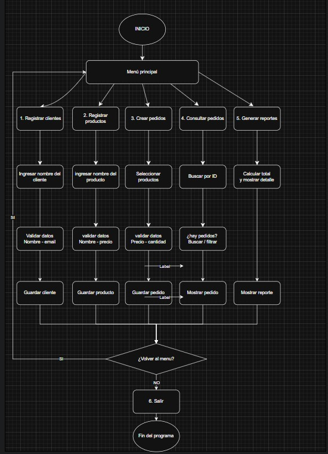

# _Order Management System_

This is a simple command-line based order management system developed in Python. It allows users to register customers and products, create new orders, view existing orders, and generate basic income reports.

## _Features_

*   **Customer Registration:** Allows registering new customers with their name and email.
*   **Product Registration:** Allows registering new products with their name, price, and quantity.
*   **Order Creation:** Facilitates the creation of orders by associating a customer, a product, and a quantity. The system automatically calculates the total.
*   **Order Inquiry:** Displays a list of all registered orders with their details.
*   **Income Calculation:** Calculates the total income from the saved orders.
*   **Report Generation:** Provides a detailed daily report of the orders.
*   **Data Persistence:** Order data is saved in a `pedidos.json` file to maintain information between sessions.

## _Project Structure_

The project is organized into the following modules:

-   `Menu.py`: Displays the main menu and manages user navigation.
-   `gestion_datos.py`: Is in charge of loading and saving order data in JSON format.
-   `Crear_P.py`: Contains the logic for creating a new order.
-   `Consulta_P.py`: Contains the logic for displaying all registered orders.
-   `registro.py`: Manages the registration of new customers.
-   `R_Productos.py`: Manages the registration of new products.
-   `Calculo_Ingresos.py`: Provides the functionality to calculate total income.
-   `reporte.py`: Generates a detailed report of the orders.
-   `Colors.py`: Defines colors for the console output, improving the user interface.

## _How to Get Started_

To run this project, make sure you have Python installed and simply run the main file that contains the menu loop.

*This project was created as part of a Python development challenge.*

---

### _Contributors_

- Isac Alvarez
- Maryuris Aragon
- Keiner Ramires

--- 

### _Diagrama de Flujo_

